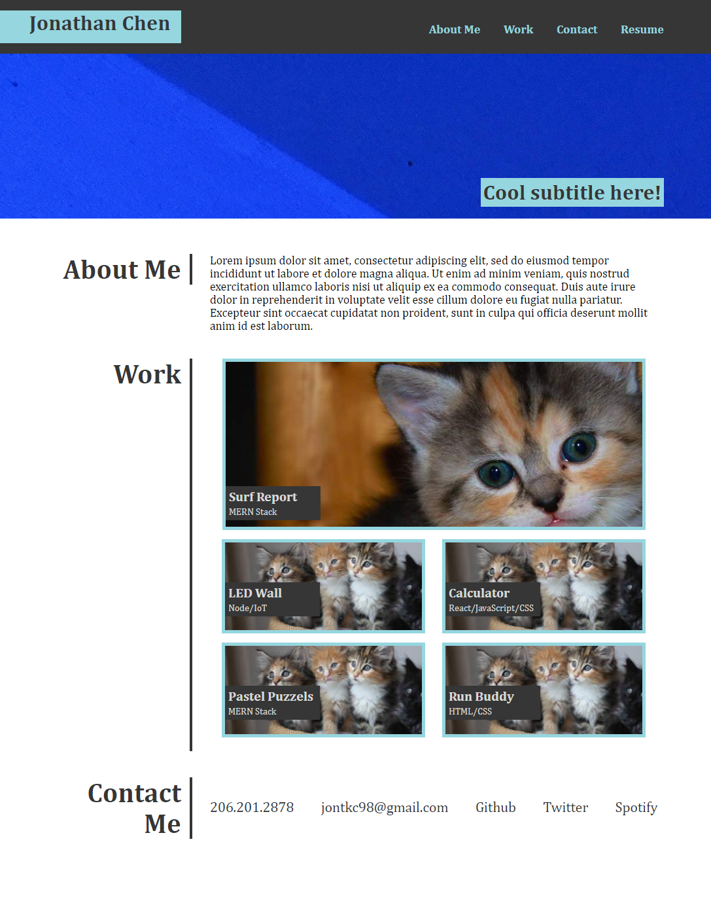

# Portfolio

## Description
This project is the initial design and creation of my portfolio which I will be providing to recruiters to show my knowledge and capabilities. 

## Table of Contents
- [Description](#description)
- [Reference Website](#reference-website)
- [Portfolio Website Preview](#portfolio-website-preview)
- [Cloning](#cloning)
- [HTML Adjustments](#Wireframing/HTML)
- [CSS Adjustments](#css)
- [Conclusion](#conclusion)

## Reference Website

Click to Reveal

## Portfolio Website Preview

Click to Reveal

Click the preview to be redirected to the website!

## Cloning
Since I am currently unfamiliar with backend I have decided that this first iteration is to focus on HTML and CSS. I was given an initial design as reference and as practice I tried to copy the design as close as possible.

## Wireframing/HTML
This project was a great learning experience because it is the first time I built a website from scatch. What quickly became apparent was the importance of setting up a good wireframe. Since I built this portfolio based off of a reference, taking into account how I was going to use my semantics tags and CSS was important when setting up my wireframe.

## CSS
CSS proved to be a bigger challenge than I imagined. The wireframe helped a lot since if I got lost I could always refer back to identify which tags or classes I should use to select what I wanted. Comments kept sections separated and clean but it really showed that I needed to improve my understanding on which properties are inherited to reduce redundancy. My favorite part was adding a personal touch by making the navigation bar and contact links interactable. I found a great [Youtube guide](https://youtu.be/FEmysQARWFU) by Kevin Powell that teaches how to make great UI elements without needing anything other than basic HTML and CSS.

## Mobile Support
Finally the last thing that I worked on was integrating mobile support. This turned out to be pretty straight forward as it primarily was just making all the flexboxes be in the column direction when the display window was smaller than 900px. 

## Conclusion
I am pretty happy with how this project turned out. Working with all the new concepts I learned was strange and confusing at times but I am glad I did since applying them was the best way to learn them for me. I feel that after this project I have a good understanding on how HTML structures, Flexboxes, pseudo elements, pseudo classes, and media queries work and how to apply them.